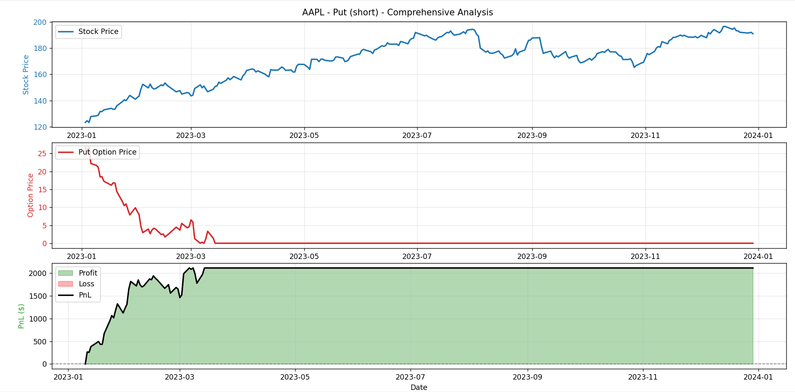

<!-- # Options Pricing Model + PnL Simulator (Black-Scholes-Merton Model)

A Python-based backtesting tool for options trading strategies, powered by the **Black-Scholes-Merton pricing model**.  
It allows you to simulate the price of call and put options, track **profit & loss (PnL)**, and visualize results with dynamic plots.

## Introduction
This project fetches historical stock price data from **Yahoo Finance**, calculates option prices using the **Black-Scholes-Merton model**, and simulates PnL for long/short option positions.  
It’s perfect for **quantitative traders**, **options enthusiasts**, or anyone exploring systematic options strategy testing.


## Features
- **Black-Scholes option pricing** for calls and puts
- **PnL tracking** for long or short option positions
- **Execution date simulation** to start PnL from a specific point
- **Historical data loading** via `yfinance`
- **Interactive visualizations** for:
  - Stock vs. Option prices
  - Profit & Loss charts
- **Command-line interface** for easy configuration

## Installation
```bash
# Clone this repository
git clone https://github.com/Abhinav-Kumar2/options_pricing_model.git

# Create a virtual environment
python -m venv venv
source venv/bin/activate 

# Install dependencies
pip install -r libraries.txt
```

## Usage & Example
You can run the backtest directly from the command line.  
Example 1 — Long Call:
python main.py --ticker AAPL --option_type call --strike 105 \
    --start 2023-01-01 --end 2024-01-01 \
    --expiry_days 30 --position long --contracts 2 \
    --execution_date 2023-06-15

## Plots


```bash
##Project Structure
├── backtesting/
│   ├── backtester.py          # Core PnL simulation logic
├── pricing/
│   ├── black_scholes.py       # Black-Scholes pricing function
├── cli.py                     # CLI argument parser
├── config.py                  # Default settings
├── data_handling.py           # Yahoo Finance data loader
├── data_logging.py            # Logger setup
├── main.py                    # Entry point for running backtests
├── visualization.py           # Plotting functions
├── libraries.txt           # Dependencies list
└── README.md                 

```
## License
MIT
 -->

# Options Pricing Model + PnL Simulator

## Introduction

This project implements a comprehensive options pricing and backtesting framework that supports multiple numerical methods for valuing European and American-style options. Built as a command-line tool, it enables quantitative analysis of options strategies by combining classical financial models with historical market data.

The simulator supports four pricing methodologies: the analytical Black-Scholes model for European options, the Cox-Ross-Rubinstein (CRR) binomial tree for American options, trinomial lattices for enhanced accuracy, and Monte Carlo simulation with Longstaff-Schwartz for path-dependent valuation. Users can backtest trading strategies across different time periods, analyze profit and loss dynamics, and visualize results through integrated plotting capabilities.

Key features include flexible position management (long/short), configurable contract sizes, custom execution dates, and comprehensive logging for reproducible analysis.

## Files of interest
- Entry: [main.py](main.py)
- CLI: [cli.py](cli.py)
- Backtest logic: [backtesting/backtester.py](backtesting/backtester.py)
- Pricing implementations:
  - [pricing/black_scholes.py](pricing/black_scholes.py)
  - [pricing/binomial_options.py](pricing/binomial_options.py)
  - [pricing/trinomial_options.py](pricing/trinomial_options.py)
  - [pricing/monte_carlo.py](pricing/monte_carlo.py)
- Data I/O: [data_handling.py](data_handling.py)
- Visualization: [visualization.py](visualization.py)
- Logging: [data_logging.py](data_logging.py)
- Defaults: [config.py](config.py)

## Installation
```bash
# Clone this repository
git clone https://github.com/Abhinav-Kumar2/options_pricing_model.git

# Create a virtual environment
python -m venv venv
source venv/bin/activate 

# Install dependencies
pip install -r libraries.txt
```

## Quick usage
Basic command pattern:
python main.py --ticker <TICKER> --option_type <call|put> --strike strike_price --start YYYY-MM-DD --end YYYY-MM-DD --expiry_days <days> [options]

## Common options
- --pricing_model {black_scholes,binomial,trinomial,monte_carlo} (default: black_scholes) — see [cli.py](cli.py)
- --steps N — number of steps for binomial/trinomial (and LSM time steps)
- --simulations N — Monte Carlo simulations (monte_carlo)
- --american — enable American option logic (binomial/trinomial/monte_carlo LSM)
- --position {long,short}, --contracts N, --execution_date YYYY-MM-DD

## Examples (one command per model)

- Black‑Scholes (default):

  python main.py --ticker AAPL --option_type call --strike 150 --start 2023-01-01 --end 2024-01-01 --expiry_days 30 --position long --contracts 1 --execution_date 2023-01-10 --pricing_model black_scholes


- Binomial (CRR)

  python main.py --ticker AAPL --option_type put --strike 150 --start 2023-01-01 --end 2024-01-01 --expiry_days 60 --position short -contracts 1 --execution_date 2023-01-10 --pricing_model binomial --steps 500 --american


- Trinomial

  python main.py --ticker AAPL --option_type put --strike 150 --start 2023-01-01 --end 2024-01-01 --expiry_days 60 --position short --contracts 1 --execution_date 2023-01-10 --pricing_model trinomial --steps 500 --american

  
- Monte Carlo (European)

  python main.py --ticker AAPL --option_type call --strike 150 --start 2023-01-01 --end 2024-01-01 --expiry_days 30 --position short --contracts 1 --execution_date 2023-01-10 --pricing_model monte_carlo --simulations 200000

- Monte Carlo (American — LSM)

  python main.py --ticker AAPL --option_type put --strike 150 --start 2023-01-01 --end 2024-01-01 --expiry_days 120 --position short --contracts 1 --execution_date 2023-01-10 --pricing_model monte_carlo --american --simulations 100000 --steps 252


## Plots


## Output
- CSV results: backtest_pnl_results.csv (saved by [main.py](main.py))
- Log file: options_backtest.log (configured in [config.py](config.py) / [data_logging.py](data_logging.py))
- Plots are shown interactively via [visualization.py](visualization.py)

## Notes
- If you pass --execution_date, PnL calculation starts from the first date >= execution_date (see [backtesting/backtester.py](backtesting/backtester.py)).
- For Monte Carlo, increase --simulations to reduce noise; for American options set --american.

## License
MIT